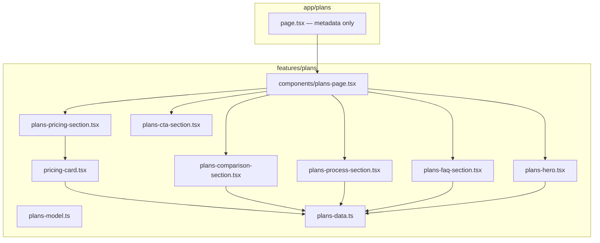

# Premium Persian Pricing Page (`/plans`)

## Current state

- No [`src/app/plans`](src/app/plans) route exists today.
- Navbar and mobile bottom nav link **پلن‌ها** to [`/`](src/components/shared/ui/Navbar.tsx) (home), which should become `/plans`.
- Established pattern to follow: thin route in `app/`, feature entry in `features/<name>/`, data in `*-model.ts` + `plans-data.ts`, UI-only components, no API/hooks needed for static content.
- Visual language already in repo: dark background, `primary` mint green, glass borders (`border-white/10`, `backdrop-blur`), radial glows via [`Radial`](src/components/shared/effects/Radial.tsx), gradient cards like [`ProjectsCard`](src/components/ui/OurProjects/ProjectsCard.tsx).

## Architecture



## File structure to add

```
src/features/plans/
├── plans-model.ts          # PricingPackage, ComparisonRow, ProcessStep, FaqItem
├── plans-data.ts           # All Persian copy, prices, features, badges
└── components/
    ├── plans-page.tsx      # Composes all sections
    ├── plans-hero.tsx
    ├── plans-pricing-section.tsx
    ├── pricing-card.tsx
    ├── plans-comparison-section.tsx
    ├── plans-process-section.tsx
    ├── plans-faq-section.tsx
    └── plans-cta-section.tsx

src/app/plans/page.tsx      # Metadata + <PlansPage />
```

## Section-by-section implementation

### 1. Hero — `plans-hero.tsx`

- Full-width section with [`HeroBg`](src/components/ui/HeroSection/HeroBg.tsx) + [`Radial`](src/components/shared/effects/Radial.tsx) glow (same premium backdrop as team/contact).
- Headline (Persian): professional web development for businesses/startups/brands.
- Supporting paragraph: WordPress vs custom React/Next.js choice.
- Two CTAs via existing [`Button`](src/components/ui/button.tsx):
  - Primary → `/contact` (شروع پروژه / درخواست مشاوره)
  - Secondary outline → anchor `#pricing` or `#comparison`
- Responsive typography: `text-3xl → text-7xl`, centered on mobile, generous `py-20 lg:py-32`.

### 2. Pricing — `plans-pricing-section.tsx` + `pricing-card.tsx`

- Section id `pricing`, intro label + short subtitle.
- **3-column grid**: `grid-cols-1 md:grid-cols-2 xl:grid-cols-3` with gap; on `md` the featured card spans full width or orders first visually.
- **Package data** in [`plans-data.ts`](src/features/plans/plans-data.ts):

| Package              | Price           | Badge      | Highlight                                                    |
| -------------------- | --------------- | ---------- | ------------------------------------------------------------ |
| وردپرس استارتر       | ۱۵ میلیون تومان | —          | standard glass card                                          |
| وردپرس حرفه‌ای       | ۳۵ میلیون تومان | محبوب‌ترین | elevated: `scale-[1.02]`, stronger border/glow, primary ring |
| پلتفرم React/Next.js | ۸۰ میلیون تومان | —          | premium dark gradient, code icon accent                      |

- Each `pricing-card.tsx` props: `title`, `price`, `priceLabel` (شروع از), `audience`, `features[]`, `ctaLabel`, `ctaHref`, `highlighted`, `badge`.
- Feature list with `lucide-react` check icons; CTA links to `/contact`.
- Card styling reuses ProjectsCard patterns: rounded `[28px]`, inner radial gradient, dot-pattern overlay optional via `abstractpattern.svg`.

### 3. Solution comparison — `plans-comparison-section.tsx`

- Section id `comparison`.
- Two solution headers: **وردپرس** vs **توسعه اختصاصی (React/Next.js)**.
- Comparison matrix from user spec (8 rows): هزینه اولیه، سرعت راه‌اندازی، مدیریت محتوا، مقیاس‌پذیری، قابلیت‌های سفارشی، داشبورد، مناسب SaaS، انعطاف بلندمدت.
- Each row: label + WordPress value + Custom value (text or icon chips: عالی / متوسط / محدود).
- Layout:
  - Desktop: 3-column table with glass container
  - Mobile: stacked cards per row OR horizontal scroll table (prefer stacked row cards for readability)
- Subtle divider lines, primary accent on winning column per row where appropriate.

### 4. Project process — `plans-process-section.tsx`

- 4 steps from user brief (مشاوره، UI/UX، توسعه، تست و راه‌اندازی).
- Reuse timeline approach from [`OurWorkRoute`](src/components/development/OurWorkRoute.tsx):
  - Mobile: vertical stacked steps with downward connectors
  - Desktop: horizontal 4-step connected timeline with step numbers in `GradientCircleIcon`-style circles
- Step data driven from `plans-data.ts`.

### 5. FAQ — `plans-faq-section.tsx`

- Plans-specific questions (not generic home FAQ): pricing scope, timeline, payment terms, support, future development, WordPress vs React decision.
- Reuse [`AccordionFaq`](src/components/ui/FAQ/AccordionFaq.tsx) — map `faqItems` from data.
- Single column on mobile, optional 2-column on `lg` (split array in half).

### 6. Final CTA — `plans-cta-section.tsx`

- Custom section (do **not** reuse generic [`CallToAction`](src/components/ui/CallToAction.tsx) — copy is pricing-specific).
- Glass panel with gradient background (similar to Cta but bespoke copy).
- Persuasive Persian trust copy + two buttons: تماس با ما (`/contact`) + مشاوره رایگان (`/contact` or `tel:` placeholder).
- Optional large logo watermark like existing CTA for brand consistency.

### 7. Route + navigation updates

- Add [`src/app/plans/page.tsx`](src/app/plans/page.tsx):
  ```tsx
  export const metadata = {
    title: "پلن‌ها و قیمت‌گذاری | ZWORKS",
    description: "پکیج‌های وردپرس و توسعه اختصاصی React/Next.js",
  };
  ```
- Update [`Navbar.tsx`](src/components/shared/ui/Navbar.tsx): `پلن ها` → `/plans`
- Update [`nav-items.ts`](src/features/layout/lib/nav-items.ts): پلن‌ها `href` + `matchPaths: ["/plans"]`

## Design tokens (no new CSS file unless needed)

Stick to existing Tailwind theme from [`globals.css`](src/app/globals.css):

- Background: `bg-background`, cards `bg-[#1a1a1a]` / `bg-base`
- Accent: `text-primary`, `border-primary/30`
- Glass: `bg-white/5 backdrop-blur-xl border-white/10`
- Typography: `font-iransans`, `font-black` headings, `text-content-gray` body
- Hover: `transition-all duration-300`, shadow lift on cards

## Responsive checklist

| Section    | Mobile                              | Desktop                                  |
| ---------- | ----------------------------------- | ---------------------------------------- |
| Hero       | stacked CTAs, smaller type          | side-by-side optional decorative element |
| Pricing    | 1 card per row; featured card first | 3 equal columns; middle card elevated    |
| Comparison | stacked row cards                   | full comparison table                    |
| Process    | vertical timeline                   | horizontal 4-step                        |
| FAQ        | single column                       | 2 columns                                |
| CTA        | stacked buttons full-width          | inline buttons                           |

Page wrapper: `overflow-x-hidden font-iransans` + section spacing `gap-16 lg:gap-32` (match team page).

## What we will NOT do (scope control)

- No payment/checkout integration
- No CMS or dynamic pricing API
- No new global design system — extend existing components only
- No refactor of unrelated pages

## Verification

- Typecheck with `tsc --noEmit`
- Manually test `/plans` at mobile (`<1024px`) and desktop widths
- Confirm bottom nav + desktop navbar highlight `/plans` correctly
- Confirm all CTAs route to `/contact`
